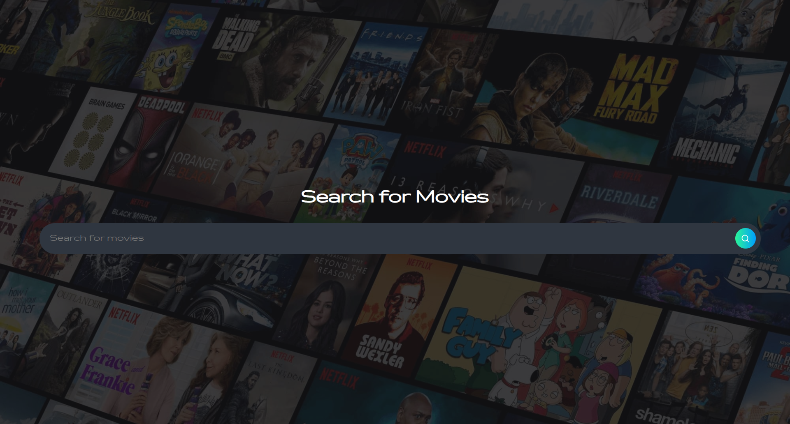
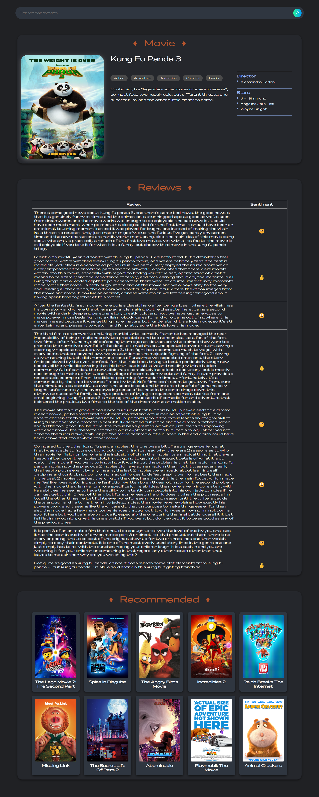

# 🎬 Movie Recommendation System with Sentiment Analysis  

This project combines **collaborative filtering** and **natural language processing (NLP)** to enhance movie recommendations.

## 📌 Index  
1. [Key Features](#-key-features)  
2. [Dataset Collection 📖](#-dataset-collection-)  
3. [Data Cleaning 🧹](#-data-cleaning-)  
4. [Working of the Recommendation System ⚙️](#-working-of-the-recommendation-system-)  
5. [Working of Sentiment Analysis ⚙️](#-working-of-sentiment-analysis-)  
6. [How to Run the Project? 🤔](#-how-to-run-the-project-)
7. [Sneak Peek 👀](#-sneak-peek-)

## 🔹 Key Features  
- **Movie Recommendations:** Suggests movies based on similarities in **directors, actors, and genres**.  
- **Sentiment Analysis:** Uses **ensemble learning** with multiple NLP models to classify user reviews as **positive, negative, or neutral**, offering deeper audience insights.  

By merging recommendation techniques with sentiment analysis, this system provides a **more personalized** and **insightful** movie-watching experience.  

## 🔹 Dataset Collection  📖

To build an effective movie recommendation system and sentiment analysis model, we gathered a diverse dataset spanning multiple years.  

- **Time Period:** The dataset includes movies from **2016, 2018, 2019, and 2020** (excluding 2017).  
- **Data Sources:**
  - **2016 Movies:** Collected using the **TMDb v3 API**.  
  - **2018–2020 Movies:** Extracted from **IMDb**.  
- **Review Data:** All movie reviews were sourced from **IMDb**, ensuring a rich dataset for sentiment analysis.

## 🔹 Data Cleaning  🧹

After collecting the dataset, we performed thorough **data cleaning** to ensure accuracy and consistency. The process involved:  

- Removing incomplete or missing entries.  
- Keeping only **valid and available** values for:  
  - 🎬 **Movie Names**  
  - 🎭 **Directors**  
  - 🎞️ **Actors**  
  - 🎥 **Genres**

## 🔹 Working of the Recommendation System ⚙️  

Our recommendation system utilizes **collaborative filtering** to identify similarities between movies based on key attributes.  

### 🔍 How It Works:  
1. **Feature Similarity Calculation:**  
   - We analyze similarities between **genres, actors, and directors**.  
2. **Weighted Similarity Score:**  
   - A **weighted sum** approach is used to compute a similarity score between two movies.  
3. **Top Recommendations:**  
   - Based on the similarity score, the **top 10 most relevant movies** are suggested.  

### 🎯 Weight Optimization:  
- The weights assigned to each feature are **not random**.  
- They were fine-tuned through **trial and error**, considering the **importance of each retained feature** in predicting relevant recommendations.

## 🔹 Working of Sentiment Analysis ⚙️  

This project focuses on analyzing **movie reviews** and classifying them into three categories:  
- ❤️ **Positive**  
- 🖤 **Neutral**  
- 💔 **Negative**  

Since most pre-trained models lack sufficient **neutral sentiment data**, we developed a **custom pipeline** using **polarity scores** to label reviews accurately.  

### 🚀 Workflow  

1️⃣ **Data Integration** 📂  
   - Reviews were collected from multiple sources (e.g., 2016, 2018, etc.).  
   - All reviews were merged into a **single dataset** for streamlined processing.  

2️⃣ **Data Cleaning** 🧹  
   - Removed unnecessary noise, ensuring **high-quality** data for analysis.  

3️⃣ **Sentiment Labeling** ✍  
   - Since the dataset lacked predefined labels, we assigned them using **polarity scores**:  
     - 💚 **Positive** → Polarity > Threshold  
     - 💔 **Negative** → Polarity < -Threshold  
     - 🖤 **Neutral** → Polarity within the threshold range  

4️⃣ **Handling Class Imbalance** ⚖  
   - The dataset was **imbalanced**, with positive reviews dominating.  
   - To **balance sentiment classes**, we applied **SMOTE** (Synthetic Minority Oversampling Technique), ensuring fairness and reducing bias.  

5️⃣ **Model Training** 📊  
   - We trained multiple **machine learning models** for classification:  
     - 🤖 **Naive Bayes**  
     - 🧠 **Support Vector Machine (SVM)**  
     - 🚀 **Gradient Boosting**  
     - 🛠 **Other classifiers**  
   - The trained models were **saved in `.pkl` format** for easy deployment.

## 🔹 How to Run the Project? 🤔  

Follow these steps to set up and run the project on your local machine: 

### 1️⃣ **Install Dependencies**

#### **Create a Virtual Environment**  
```bash
python -m venv env
```

#### **Activate the virtual environment**  
```bash
.\env\Scripts\activate
```

#### **Install Required Libraries**  
```bash
pip install -r requirements.txt
```

### 2️⃣ **Set Up Environment Variables**

Create a ```.env ``` file in the root directory and add the following line:
```
PROJECT_DIR='your/project/root/directory'
```

### 3️⃣ **Run the Project**

Navigate to the project's root directory and execute:
```
python main.py
```

### 4️⃣ **Access the Web Application**
Once the server is running, open your browser and go to:
```
http://127.0.0.1:5000
```

Now, you can explore the Movie Recommendation System with Sentiment Analysis in action! 🎬✨

## 🔹 Sneak Peek 👀  

- ### **Home Page**  

    Explore and search for any movie from our extensive database with ease.

      

-   ### **Main Page**  

    Get a glimpse of the main interface when the application is live and fully operational.

    